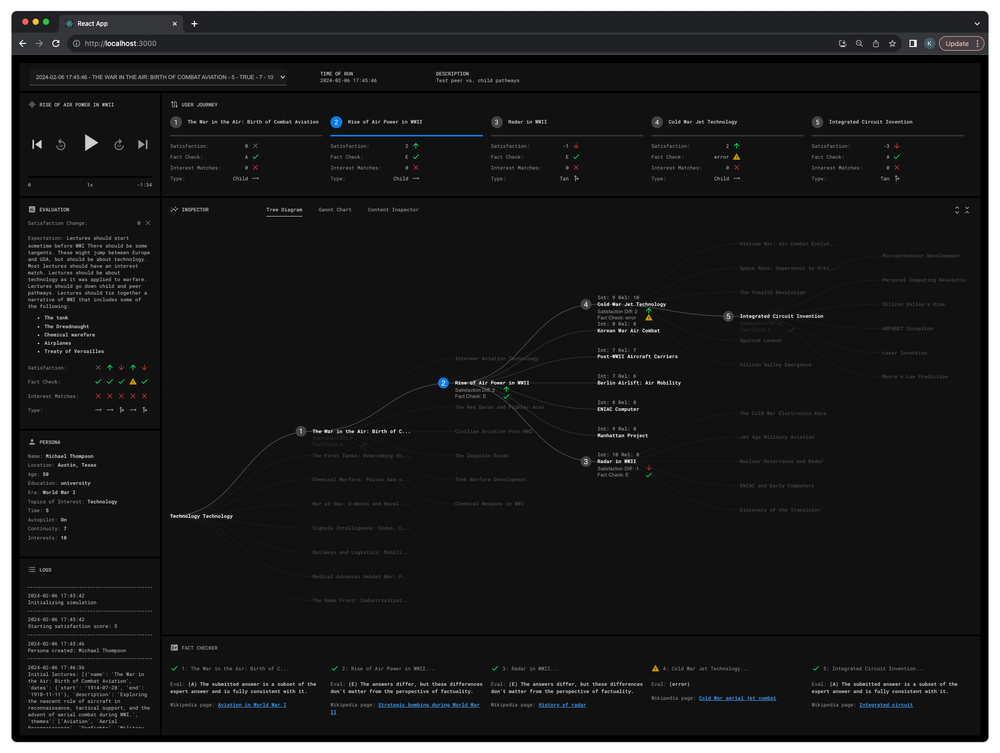

# Historical Pathways
Historical Pathways is a speculative design that imagines how AI might be used to teach users history in new and novel ways. 

This repo contains a Python-based simulator and a React simulation analyzer.

See [design case study here]([https://example.com](https://case-studies-app-81a2bd548d59.herokuapp.com/historical_pathways))

## Simulator
The simulator creates a persona / agent and simulates a user experience. The goals of the simulation are to:

- Evaluate non-deterministic AI output. Especially, ensure narrative continuity when the AI generates its own promts and content (i.e., determine if connections and transitions between events make sense.)
- Evaluate the historical accuracy of the content.
- Test copilot functionality. Copilot takes user preferences, such as tolerance for expoloring historical tangents, and crafts lesson plans.
- Sense check: Render audio to get a feel of what the user experience would be like given the UI is mostly audio-based.

        
  

<span style="color:#999; ">_Screenshot of the simulation view. This app allows you to explore the simulation results._</span>


## Installation
Note: You will need an OpenAI account and an API key. 
```
# Create virtual environment
python3 -m venv venv
source venv/bin/activate

# Install reqs
pip install -r requirements.txt
python3 -m pip freeze > requirements.txt

echo 'export OPENAI_API_KEY="<OPENAI API KEY HERE/>"' >> ~/.bashrc
source ~/.bashrc
```

## Running Simulation

Note: Running each iteration will cost ~$0.15 in API call costs. A lesson with five lectures will cost around $0.75 USD.

```
# Open Jupyter
jupyter lab
```

In Jupyter, configure student_config and run cell to start simulation
```
student_config = {
    "age": 41,
    "education": "university",
    "gender": "male",
    "nationality": "American",

    # Areas of interest are anything with a time and place (e.g., "Napoleonic Era", "Assassination of Abraham Lincoln")
    "areas_of_interest": [  
        "18th Century America",
    ],

    # Topics cut accross time and place (e.g., "Military History", "Sufferage")
    "topics_of_interest": [ 
        "Journalism",
        "Elections",
    ],

    # Number of lectures. Max 8
    "time_constraint": 5, 
    
    # Autopilot takes user preferences to determine what lectures to generate
    "autopilot_on": True,

    # Autopilot: How important it is for lectures to be close to preceding lecture
    "continuity": 2, 

     # Autopilot: How important areas_of_interest is to selecting lecture
    "interests": 8,

    "description": "Test change to follow up prompts"
}
```

## Exploring Simulation Results
When simulation is finished, view results in React app
```
cd simulation_analyser

# Install requirements
npm 

# Start React server (default port 3000)
npm start
```


